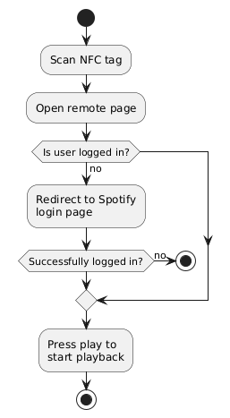

# Development Logs

## Table of Content

1. [Motivation](#1-motivation)
2. [Conceptualisation](#2-conceptualisation)
3. [Version 1 Architecture](#3-version-1-architecture)

## 1. Motivation

A random thought came to my mind one day: How does the [Divoom app](https://play.google.com/store/apps/details?id=com.divoom.Divoom&hl=en_SG&pli=1) communicate with nearby Divoom products in the same LAN? Does a Divoom Pixoo64 (or related Divoom products) run any server applications that expose API endpoints for apps to interact with it.

After some research, here's what I found:

1. Divoom's Pixoo16, Pixoo64 and TimeGate products do expose API endpoints for clients to interact with them (not just from Divoom's official app). The documentation can be found [here](https://doc.divoom-gz.com/web/#/12?page_id=196). I managed to prove this by sending curl requests to my Pixoo64 and load custom gifs found on the Internet.

This lead to the idea: Can I create a music player/media center with a Raspberry Pi as the command center, with audio output through speakers/sound bar and animation displayed through [Pixoo64](https://divoom.com/products/pixoo-64)?

## 2. Conceptualisation

I wanted the music player/media center to have the following features:

1. Allow users to login using their Spotify account.
2. Play music from Spotify account.
3. Music output through speakers/sound bar.
4. Search the Internet for gifs related to song being played, and display it on the Pixoo64.

Since the music player/media center is running on a Raspberry Pi and using Spotify as music service, thus I name this project: Pify (Raspberry **Pi** + Spoti**fy**) Player

### User flow

## 3. Version 1 Architecture

To support the features, I decided to use SvelteKit to power the frontend and server application written in Go as the backend. (Yes, I am aware that SvelteKit comes with its own Node.js backend, but I wanted to treat this project as training to familiarise with building frontend using Svelte, and brush up on my Go programming skills as well.)

In terms of jobs handled by the apps, it will be split in this manner:

### Frontend

1. Serve pages that will provide Spotify login.
2. Provide player page that will provide song playback via Spotify's Web Player SDK.
3. Also act as remote control for the Pify Player, and the pages will be accessed by mobile device in the same network.

### Backend

1. Handle authentication with Spotify.
2. User session management.
3. Handle requests to Pixoo64 device.
4. Search for gifs (For this I will be using [Giphy API](https://developers.giphy.com/docs/api/#quick-start-guide)).

The apps will be deployed as containerised apps via Docker.

### APIs needed

1. [Spotify Web API](https://developer.spotify.com/documentation/web-api) and [Spotify Web Playback SDK](https://developer.spotify.com/documentation/web-playback-sdk)
2. [Giphy API](https://developers.giphy.com/docs/api/#quick-start-guide)
3. Pixoo64 API by Divoom

### Hardware needed

1. [Raspberry Pi 5 + official enclosure](https://sg.cytron.io/p-raspberry-pi-5-computer-with-16gb-ram)
2. Speakers/sound bar (decided to use a [Creative Stage Air V2](https://sg.creative.com/p/speakers/creative-stage-air-v2) which supports Aux-in, Bluetooth 5.3 and USB audio for under S$60 price tag)
3. Pixoo64
4. NFC tags (decided to include this as I wanted to stick a tag on top of the enclosure and program it to instruct NFC-enabled mobile devices to open the login page when they tap onto the tag)

### Additional considerations

As song playback is done via Chromium browser (one of the default web browsers that comes along with Raspberry Pi OS), automatic media playback will be blocked by the browser until user interacts with the web page as part of the browser's policy. One of the following approaches can be used to workaround the restriction:

1. Start Chromium browser with `no-user-gesture-required` flag: `chromium-browser --no-user-gesture-required`, or
2. Open the player page in Chromium, and in settings for page under "Site Settings", set "Allow" for Sound setting.

### Software Architecture

#### Frontend

Frontend is powered mainly by SvelteKit.

## 4. Version 2 Architecture

### APIs needed

1. 

### Hardware needed

1. 

### Software Architecture
